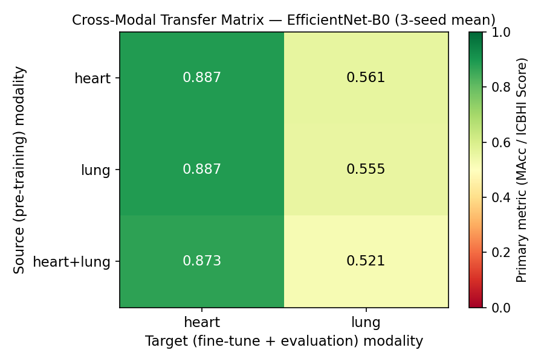
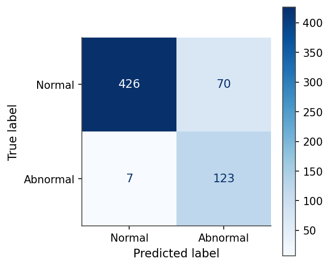
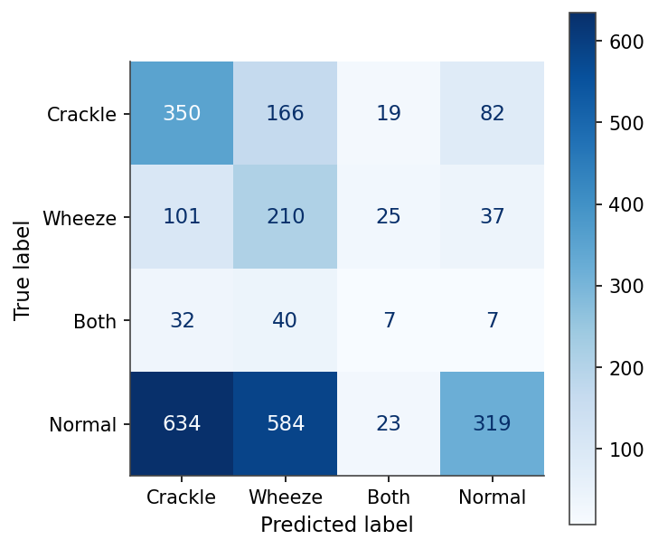

<h1 align="center">Диагностика патологий кардиореспираторной системы и магистральных артерий по звуковым данным</h1>

<div align="center">
	
	
	
	
	
</div>

<p align="center">
<strong>Cardiorespiratory &amp; Arterial Sound Diagnosis</strong> — воспроизводимое, устойчивое к утечке
данных сравнительное исследование классических методов (MFCC + SVM / Random&nbsp;Forest / XGBoost /
логистическая регрессия) и глубокого обучения (компактная CNN, EfficientNet-B0, Audio Spectrogram
Transformer) для диагностики патологий кардиореспираторной системы и магистральных артерий по звукам
аускультации — тоны сердца (фонокардиограммы), дыхательные шумы и, аналитически, артериальные шумы.
</p>

---

# Команда

| ФИО | Роль | Группа | GitHub |
|-----|------|--------|--------|
| Цембер Андрей Алексеевич | Автор (исследовательский проект) | БПАД244 | [OWNER](https://github.com/OWNER) |

Научный руководитель — **Томащук Корней Кириллович** (преподаватель, факультет компьютерных наук
НИУ ВШЭ). Курсовой проект, программа «Прикладной анализ данных» (ПАД), 2-й курс, 2025–26 уч. г.

# Введение

Проект исследует, насколько хорошо машинное обучение поддерживает **акустический скрининг** патологий
кардиореспираторной системы сразу в нескольких модальностях аускультации. Под единым, устойчивым к
утечке данных конвейером рассматриваются две клинические модальности — тоны сердца (PhysioNet/CinC 2016)
и дыхательные шумы (ICBHI 2017); третья модальность, артериальные шумы, рассматривается аналитически,
поскольку открытого размеченного набора данных не существует.

Ключевой методический вклад — **идентичный протокол оценки** для обеих модальностей: строгое групповое
разбиение, исключающее утечку данных, фиксированные сиды, закреплённые версии библиотек и единое семейство
метрик, что делает сравнение методов между модальностями честным и воспроизводимым. Работа намеренно
оформлена как набор честных базовых решений без утечки, а не как погоня за state-of-the-art.

# Возможности

- единый, управляемый конфигурацией (`config.py`, `SEED = 42`) конвейер, применяемый идентично к обеим
  модальностям: ingest → препроцессинг → сегментация → признаки → групповое разбиение → обучение → оценка;
- **устойчивое к утечке групповое разбиение** с явной проверкой нулевой утечки (patient-level для лёгких,
  recording-level для сердца — у CinC 2016 нет открытого сопоставления записей с пациентами);
- **классическая ветка**: MFCC + Δ/ΔΔ + спектральные статистики → логистическая регрессия, SVM (RBF),
  случайный лес, XGBoost;
- **глубокая ветка**: лог-мел спектрограммы → компактная CNN и трансферная EfficientNet-B0, с подбором
  гиперпараметров (HPO, 128 проб, отбор только по валидации) и усреднением по трём сидам {1, 2, 42};
- **межмодальный анализ** (новизна): перенос ранжирований методов, прямой перенос признаков, совместная
  многозадачная модель и ранговая корреляция Спирмена;
- аналитический под-этюд по артериальным (каротидным) шумам;
- полный набор тестов (утечка / детерминизм / метрики) и пиннинг зависимостей (`uv.lock` + `requirements.txt`).

# Документация

> [!NOTE]
> Собранный отчёт лежит в папке [docs/pdf](docs/pdf); исходник отчёта в формате **Typst** — в папке
> [report](report). Титульный лист — первая страница отчёта; аннотация на русском и английском — в начале;
> приложения A–D (полные таблицы метрик, волюметрика, галерея спектрограмм, структура репозитория) — в конце.

| Документ | Файл |
|----------|------|
| Итоговый отчёт (research report, EN) | [Отчёт.pdf](docs/pdf/Отчёт.pdf) |
| Отчёт для проверки на антиплагиат (DOCX) | [Report_Tsember_antiplagiat.docx](report/Report_Tsember_antiplagiat.docx) |
| Исходный код отчёта (Typst) | [report/](report) |

# Основные результаты

Метрика: **MAcc = (Se + Sp) / 2** для сердца (бинарная задача); **ICBHI Score = (Se + Sp) / 2** для лёгких
(4 класса). Строки глубокого обучения настроены HPO (128 проб, отбор по валидации) и приведены как
среднее ± стд по сидам {1, 2, 42}; классические строки — детерминированные одиночные прогоны.

| Модальность | Семейство | Лучшая модель | Метрика |
|-------------|-----------|---------------|---------|
| Сердце (CinC 2016) | классика | XGBoost (набор B) | **MAcc 0.903** |
| Сердце (CinC 2016) | глубокое | EfficientNet-B0 | **MAcc 0.898 ± 0.008** |
| Лёгкие (ICBHI 2017) | классика | SVM (набор B) | **ICBHI 0.537** |
| Лёгкие (ICBHI 2017) | глубокое | EfficientNet-B0 | **ICBHI 0.555 ± 0.016** |

**Ключевые выводы**

1. **После равного HPO разрыв «классика vs. глубокое обучение» на сердце сходится к шуму**
   (XGBoost 0.903 ≈ EfficientNet-B0 0.898 ± 0.008); лёгкие трудны для *всех* семейств (~0.54–0.56).
2. **Ранжирования методов переносятся между модальностями лишь частично** — XGBoost доминирует на сердце,
   но падает на третье место на лёгких; SVM стабильно конкурентен. Спирмен ρ = 0.60 (p = 0.40, n = 4).
3. **Глубокий межмодальный перенос сильно асимметричен**: лёгкие→сердце переносится почти как in-domain
   (MAcc 0.854 / 0.876), сердце→лёгкие — слабый/нейтральный (ICBHI 0.524 / 0.526).
4. **Честное ограничение по AST**: предобученный Audio Spectrogram Transformer полностью интегрирован, но в
   рамках доступного бюджета дообучения коллапсирует к мажоритарному классу — задокументировано как
   честная не-сходимость (без выдуманных цифр), представлено как методическое расширение.
5. **Артериальные шумы** рассмотрены аналитически — открытого датасета каротидных шумов не существует.

Все числа — в `results/tables/unified_comparison.csv` (20 строк) и CSV `cross_modal_*` / `metrics_*`;
рисунки — в `results/figures/`.

<p align="center">
  
</p>
<p align="center"><em>Межмодальная матрица переноса: лёгкие→сердце переносится почти как in-domain, сердце→лёгкие — нет.</em></p>

<p align="center">
  
  
</p>
<p align="center"><em>Матрицы ошибок: лучший классификатор сердца (XGBoost) и лёгочная CNN.</em></p>

# Воспроизведение

**Требования:** [uv](https://astral.sh/uv) (Astral), Python 3.11.

```bash
uv sync                          # создаёт .venv/ и ставит закреплённый стек
# либо для Colab / проверяющих:
pip install -r requirements.txt
```

**Загрузка датасетов** (после `uv sync`):

```bash
uv run python scripts/download_heart.py    # PhysioNet CinC 2016 (~181 МБ, без авторизации)
uv run python scripts/download_lung.py     # ICBHI 2017 через Kaggle API (~1.5 ГБ)
uv run python scripts/fetch_icbhi_split.py # официальное 60/40 patient-independent разбиение
```

**Сквозной запуск исследования** (конвейер управляется `config.py`: `SEED = 42` и все пути):

```bash
# 1. Манифест + устойчивые к утечке групповые разбиения + EDA
uv run python scripts/build_manifest.py
uv run python scripts/make_splits.py
uv run python scripts/run_eda.py

# 2. Классическая ветка — MFCC/Δ (+ спектральные) признаки → SVM / RF / XGBoost / LogReg
uv run python scripts/build_features.py
uv run python scripts/run_classical.py

# 3. Глубокая ветка — лог-мел спектрограммы → SmallCNN + EfficientNet-B0
uv run python scripts/build_spectrograms.py
uv run python scripts/run_cnn.py            # базовые DL-строки + кривые/матрицы ошибок
uv run python scripts/run_hpo.py            # 128-пробный поиск гиперпараметров (только по валидации)
uv run python scripts/run_multiseed.py      # 3 сида, среднee ± стд
uv run python scripts/run_ast.py            # AST (честная запись не-сходимости)

# 4. Новизна — глубокий межмодальный перенос + многозадачная модель + Спирмен
uv run python scripts/run_cross_modal.py --arch both

# 5. Тесты
uv run pytest -q
```

**Сборка отчёта** (из корня репозитория — флаг `--root` обязателен, рисунки ссылаются на `../../results/...`):

```bash
typst compile --root . report/main.typ report/main.pdf
```

# Гарантии воспроизводимости

- **Сид:** `SEED = 42` (в `config.py`, импортируется в начале каждого скрипта); глубокие строки дополнительно
  усреднены по сидам {1, 2, 42}.
- **Устойчивые к утечке групповые разбиения:** patient-level для лёгких (официальное 60/40 ICBHI), recording-level
  для сердца (у CinC 2016 нет сопоставления записей с пациентами); `src/split.py` проверяет нулевое пересечение
  на (train, test) **и** (train, val).
- **Без обходных путей с утечкой:** нет глобального скейлера (масштабирование только внутри CV-фолда), нет SMOTE,
  нет отбора модели по тесту (HPO отбирает только по валидации).
- **Закреплённые зависимости:** `uv.lock` (точно) + `requirements.txt` (pip-экспорт).
- **Честная отчётность:** не сошедшиеся / слабые / отрицательные результаты записаны как реальные числа.

# Структура репозитория

```
config.py                # SEED=42, общие пути, частоты дискретизации
pyproject.toml / uv.lock # закреплённые зависимости
requirements.txt         # pip-экспорт для Colab/проверяющих
src/                     # модули конвейера (ingest, preprocess, features, train_*, metrics, cross_modal, ...)
scripts/                 # CLI-драйверы (download → features → эксперименты)
tests/                   # тесты на утечку / детерминизм / метрики / конвейер
params/                  # heart.yaml / lung.yaml — параметры препроцессинга
results/{tables,figures} # CSV результатов + рисунки отчёта
report/                  # исходник отчёта на Typst (sections/ + refs.bib) → PDF
docs/pdf/                # собранный отчёт (PDF) + версия для антиплагиата (DOCX)
notebooks/               # EDA + GPU-запуск
```

# Лицензия

Код — под лицензией **MIT** (см. [`LICENSE`](LICENSE)). Датасеты не распространяются в этом репозитории и
остаются под собственными лицензиями: PhysioNet/CinC 2016 (Open Data Commons Attribution v1.0) и ICBHI 2017
(открыт для исследовательского использования; цитировать Rocha et al. 2019). Загрузка — скриптами из `scripts/`.
